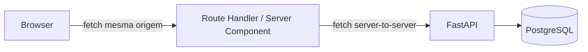

# Blick

Plataforma de avaliação de desempenho hierárquica. Um líder avalia seus liderados
(diretos e indiretos) em 6 critérios ponderados, gerando uma nota de 0 a 100 por
semana.

## Produção

- Frontend: https://blick-nu.vercel.app
- API: https://blick-qwbk.onrender.com
- Docs (Swagger): https://blick-qwbk.onrender.com/docs

Vercel (frontend) + Render (API + Postgres, mesma região, rede privada).

## Stack

| Camada   | Tecnologia                                                            |
| -------- | --------------------------------------------------------------------- |
| Frontend | Next.js 16 (App Router), React 19, TypeScript strict, Tailwind CSS v4 |
| Backend  | Python 3.12, FastAPI, psycopg3 (SQL puro, sem ORM), Poetry            |
| Banco    | PostgreSQL 16                                                         |
| Infra    | Docker Compose                                                        |
| Testes   | pytest (backend), Vitest (frontend), Playwright (E2E)                 |
| CI       | GitHub Actions                                                        |

## Estrutura

```
blick/
├── api/                    # Backend FastAPI
│   ├── app/
│   │   ├── core/           # Regras de domínio (hierarquia, questões, exceções)
│   │   ├── routers/        # Endpoints HTTP
│   │   ├── schemas/        # Contratos Pydantic
│   │   └── database.py     # Conexão psycopg
│   ├── db/init/            # DDL + seed (rodam na criação do banco)
│   └── tests/              # 31 testes de integração
├── web/                    # Frontend Next.js
│   └── src/
│       ├── app/            # Rotas (App Router)
│       ├── components/     # ui/ (primitivos), sections/, layout/
│       ├── lib/            # Cliente da API, cálculos, utilitários
│       └── types/          # Tipos de domínio
└── docker-compose.yml
```

## Como rodar

### Pré-requisitos

- Docker e Docker Compose
- Node.js 20+
- npm

Portas usadas: `5432` (Postgres), `8000` (API), `3000` (frontend). Se alguma
já estiver ocupada na sua máquina, ajusta a porta host em `docker-compose.yml`
(ex: `"5433:5432"`) antes de subir.

### Backend (API + banco)

```bash
cd api
cp .env.example .env
```

`.env` só precisa de uma variável, já vem preenchida no example:

DATABASE_URL=postgresql://blick:blick@db:5432/blick

Na raiz do projeto:

```bash
docker compose up db api
```

Isso sobe `db` (Postgres 16) e `api` (FastAPI) na mesma rede, sem o `web`
(que fica pro passo seguinte, rodando via `npm run dev` com hot reload).
Se quiser subir os três serviços de uma vez, veja a seção
"Rodando tudo via Docker" mais abaixo. O banco roda os scripts de
`api/db/init/` automaticamente na primeira criação (schema + seed de 20
funcionários). Espera aparecer `Uvicorn running on http://0.0.0.0:8000` no log.

Testa: `curl http://localhost:8000/health` deve responder `{"status":"ok"}`.

### Frontend

Em outro terminal:

```bash
cd web
npm install
cp .env.example .env.local
```

`.env.local`:

API_BASE_URL=http://localhost:8000

```bash
npm run dev
```

Abre `http://localhost:3000`.

> **Nota (Windows/monorepo)**: se aparecer aviso do Turbopack sobre múltiplos lockfiles, ou o `npm run dev` travar o sistema ao compilar, confirme que só existe um `package.json`/`node_modules` dentro de `web/`, nunca na raiz do repositório. O `next.config.ts` já fixa `turbopack.root`, mas lockfile duplicado na raiz reintroduz o problema.

### Rodando tudo via Docker (sem hot reload)

Alternativa ao fluxo acima: sobe os três serviços (`db`, `api`, `web`)
containerizados na mesma rede, sem precisar instalar Node localmente.

```bash
docker compose up --build
```

`--build` é obrigatório sempre que o código mudar desde a última vez, `up`
sozinho reutiliza a imagem já construída e não reflete mudança nenhuma.
Diferente do `api` (roda com `--reload` e volume montado, reflete mudança na
hora), o `web` é build de produção estático, precisa reconstruir a imagem.

### Rodando os testes

```bash
# Backend (dentro do container, precisa de dev dependencies instaladas)
docker compose exec api poetry run pytest

# Frontend (unitário)
cd web && npm run test

# Frontend (E2E, precisa de docker compose up + npm run dev rodando)
cd web && npx playwright test
```

## Arquitetura

### Fluxo de dados: sem CORS, de propósito

Todo tráfego do browser passa pelo Next.js, nunca fala direto com o FastAPI:

- **Leituras**: Server Components fazem `fetch` server-to-server contra a API
  (`API_BASE_URL`, variável sem prefixo `NEXT_PUBLIC_`, nunca vaza pro bundle
  do browser).
- **Mutações**: Client Components chamam Route Handlers do próprio Next
  (mesma origem), que proxiam a chamada pra API.

Como o browser nunca acessa a API diretamente, CORS deixa de ser necessário.
Isso também é o que torna o cookie de sessão seguro (próximo tópico): só o
servidor Next consegue lê-lo.



### Identificação do líder: cookie httpOnly

O case dispensa login completo, mas exige identificar qual líder está avaliando.

Decisão: cookie `leader_id`, **httpOnly**, setado por um Route Handler depois de
validar contra `GET /employees` (nunca aceita um id que não existe).

- O cliente nunca lê nem escreve esse cookie diretamente.
- Toda leitura (`getLeaderId()`) acontece em Server Components, via
  `cookies()` do Next.
- Toda mutação (`leader_id` numa requisição de avaliação) é injetada pelo
  Route Handler a partir do cookie, nunca aceita do corpo enviado pelo cliente.

Isso fecha a maior fragilidade que o próprio case documenta: a API não tem
autenticação real, `leader_id`/`viewer_id` são parâmetros que o cliente
informa. O cookie httpOnly garante que, _na aplicação real_, esse valor nunca
é escolhido pelo usuário final, só pelo próprio servidor Next depois de uma
seleção validada.

### Hierarquia: CTE recursiva

A relação líder → liderado (`leader_lead`) é resolvida com `WITH RECURSIVE`
no Postgres, não em código Python. Um exemplo, buscar todos os subordinados
(diretos e indiretos) de um líder:

```sql
WITH RECURSIVE subordinates AS (
    SELECT lead_id, leader_id AS parent_id, 1 AS depth
    FROM leader_lead
    WHERE leader_id = %(leader_id)s

    UNION ALL

    SELECT ll.lead_id, ll.leader_id AS parent_id, s.depth + 1
    FROM leader_lead ll
    INNER JOIN subordinates s ON ll.leader_id = s.lead_id
)
SELECT e.id, e.name, e.position_name, s.depth, s.parent_id
FROM subordinates s
INNER JOIN employee e ON e.id = s.lead_id
```

Essa mesma CTE, com variações, resolve: listar o time (`/team`), validar se
um líder pode avaliar alguém (`ensure_can_evaluate`), e checar se um viewer
pode consultar o time de outro líder (`ensure_can_view_team`).

### Desempate: maior hierarquia

Regra do case: "as respostas cadastradas... respeitando sempre a maior
hierarquia". Quando duas pessoas avaliam o mesmo funcionário na mesma semana,
a avaliação vigente é a de quem está mais próximo do topo da organização.

Resolvido com uma segunda CTE recursiva, descendo da raiz (quem não tem líder)
até calcular a profundidade de cada funcionário a partir do topo, depois
`DISTINCT ON` ordenado por essa profundidade escolhe a avaliação certa numa
query só, sem lógica de desempate em Python.

### Autorização sem autenticação completa

Limitação documentada, não escondida: a API não valida sessão/token, os
endpoints confiam no `leader_id`/`viewer_id` recebido como parâmetro. A
proteção de "vedado ver avaliação de pares/superiores" é garantida assim:

- Toda consulta de hierarquia (`is_subordinate`, `ensure_can_view_team`)
  valida no banco se o relacionamento é real, não confia em fé.
- Na aplicação, esse parâmetro nunca é escolhido pelo usuário, vem do cookie
  httpOnly.
- Batendo direto na API (curl, Postman) com um `viewer_id` forjado, a
  validação de hierarquia ainda bloqueia: `GET /employees/2/team/evaluations?viewer_id=3`
  (alguém sem relação com o time do líder 2) responde 403.

## Endpoints

Documentação interativa completa (Swagger) disponível em
`http://localhost:8000/docs` com a API rodando.

| Método | Rota                                                      | Descrição                                                                 |
| ------ | --------------------------------------------------------- | ------------------------------------------------------------------------- |
| `GET`  | `/health`                                                 | Healthcheck                                                               |
| `GET`  | `/employees`                                              | Lista todos os funcionários                                               |
| `GET`  | `/employees/{leader_id}/team`                             | Liderados diretos e indiretos                                             |
| `GET`  | `/employees/{leader_id}/team/evaluations?viewer_id=`      | Time com avaliação vigente de cada membro (usado no dashboard)            |
| `GET`  | `/employees/{leader_id}/evaluations/given?viewer_id=`     | Avaliações já feitas por esse líder                                       |
| `POST` | `/employees/{employee_id}/evaluations`                    | Cria uma avaliação. Body: `{leader_id, answers: [{question_key, score}]}` |
| `GET`  | `/employees/{employee_id}/evaluations/current?viewer_id=` | Avaliação vigente do funcionário (prioriza maior hierarquia)              |
| `GET`  | `/employees/{employee_id}/evaluations/history?viewer_id=` | Histórico de avaliações do funcionário                                    |

### Códigos de erro

| Status | Quando                                                                                   |
| ------ | ---------------------------------------------------------------------------------------- |
| `403`  | Autoavaliação, avaliado fora da hierarquia, ou viewer sem relação com o líder consultado |
| `404`  | Funcionário ou líder inexistente                                                         |
| `409`  | Já existe avaliação desse par líder-funcionário nesta semana                             |
| `422`  | Respostas incompletas ou com pergunta repetida                                           |

## Decisões técnicas e trade-offs

Registro consciente de escolhas que um reviewer sênior questionaria em review,
com o motivo de cada uma.

**Sem autenticação completa.** O case dispensa login explicitamente. A
identidade do líder vem de um cookie httpOnly gravado pelo Next depois de uma
seleção validada contra a lista real de funcionários. A API em si confia no
`leader_id`/`viewer_id` recebido como parâmetro, batendo direto nela (curl,
Postman), esses valores podem ser forjados. A regra de "só vejo meus
subordinados" continua protegida (validação de hierarquia no banco, 403 pra
quem não tem relação), mas não existe verificação de "você é mesmo essa
pessoa". Aceitável dentro do escopo que o case define; documentado, não
escondido.

**Sem CORS.** Todo tráfego do browser passa pelo Next (Server Components pra
leitura, Route Handlers pra escrita). O FastAPI nunca é chamado diretamente
do browser, então CORS não é necessário. Ver [Arquitetura](#arquitetura).

**Nota calculada em SQL, não em Python.** `weighted_score` não é uma coluna
armazenada, é calculado on-the-fly via `SUM(score * peso) / (4 * SUM(peso))`
dentro da própria query. Os pesos (`QUESTION_WEIGHTS`) vivem só no código
Python, injetados na query via `unnest()`. Trade-off: se os pesos mudarem no
futuro, avaliações antigas recalculam automaticamente com o peso novo (correto
architeturalmente, mas historicamente diferente de "congelar a nota como foi
calculada na hora"). Dado o volume do case, o ganho de simplicidade (sem
sincronizar peso duplicado entre banco e código) superou essa desvantagem.

**Endpoint agregado pra evitar N+1.** `GET /team/evaluations` devolve o time
inteiro com a avaliação vigente de cada membro numa query só. Sem ele, o
dashboard precisaria de uma chamada por funcionário (N+1), problema real de
performance que cresce com o tamanho do time.

**`parent_id` explícito na resposta da API.** A árvore de hierarquia no
frontend depende de reconstruir a relação pai-filho. Depender só de `depth` +
ordenação alfabética da API se mostrou insuficiente (bug real, corrigido
durante o desenvolvimento): duas pessoas na mesma profundidade, filhas de pais
diferentes, ficam intercaladas, sem informação suficiente pra saber quem é
filho de quem. `parent_id` explícito resolve isso na fonte.

**Zod só em inputs, não em leituras.** Respostas da API não passam por
validação de schema no frontend (`as` direto no adapter). Justificativa: é
API própria, com contrato fechado, coberta por 40+ testes automatizados.
Validar leitura de fonte confiável é custo sem ganho real aqui. Formulários
(dado vindo de humano) usam Zod normalmente.

**Testes cobrindo pontos que já quebraram.** Além de cobertura geral, dois
conjuntos de teste existem especificamente porque a aplicação teve bug real
ali durante o desenvolvimento: `tree.test.ts` (reconstrução de hierarquia com
ordenação não-trivial) e `week.test.ts` (aritmética de calendário ISO, que
tinha bug de timezone real, corrigido depois do teste apontar).

**SEO básico implementado, técnico completo fora de escopo.** `metadata`
com Open Graph/Twitter Card e uma `opengraph-image.tsx` dinâmica (gerada via
`next/og`) garantem que o link, ao ser compartilhado, mostre título,
descrição e imagem decentes. `sitemap.ts`, `robots.ts` e JSON-LD Schema.org
não foram adicionados: o Blick é ferramenta interna atrás de seleção de
líder, sem conteúdo indexável, nenhum usuário chega via busca orgânica.

## Checklist do case

**Funcional**

- [x] Avaliar funcionários da própria hierarquia (diretos e indiretos)
- [x] Respostas 1-4 com pesos (25/20/20/15/10/10)
- [x] Imutável após envio, uma avaliação por semana por par líder-funcionário
- [x] Líder avalia indiretos mesmo que o subordinado já tenha avaliado dentro do período
- [x] Vedado ver própria avaliação, pares e superiores, só subordinados (diretos e indiretos)
- [x] Sem login completo; identificação via cookie httpOnly + troca simples de líder

**Exibição**

- [x] Identificador do avaliado
- [x] Avaliação mais recente
- [x] Histórico de avaliações
- [x] Respostas cadastradas respeitando maior hierarquia

**Técnico**

- [x] Front: Next.js (App Router), TypeScript, Tailwind CSS
- [x] Back: Python 3.12, FastAPI
- [x] Docker: todos os serviços containerizados na mesma rede
- [x] SQL parametrizado (psycopg3, `%(param)s` em toda query)

**Entregáveis**

- [x] Repositório público no GitHub
- [x] Documentação de código e endpoints (Swagger + tabela neste README)
- [x] README com setup, execução, arquitetura
- [x] Diagrama de arquitetura e fluxo

**Adicionais (não obrigatórios)**

- [x] 52 testes automatizados (32 backend pytest, 17 frontend Vitest, 3 E2E Playwright)
- [x] CI completo (lint, format, typecheck, build, testes, E2E) no GitHub Actions
- [x] Dashboard com indicadores do time (pendentes, avaliados, distribuição de notas)
- [x] Página de "Avaliação de Perfil" (visualização derivada dos 6 critérios)

## Autor

Desenvolvido por Felipe Augusto como teste técnico para a vaga de Software
Analyst na Monks.
